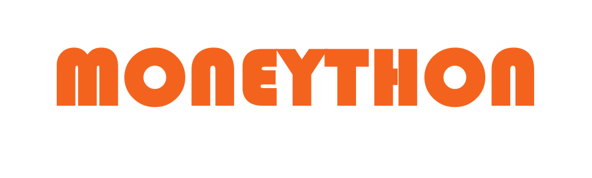

  
  <strong>하루 5분, 금융이 쉬워진다. moneython과 함께 성공적인 재태크를 위한 꾸준한 공부</strong>

## 💡 누구를 위한 서비스인가요?
- **금융 입문자**: 어렵고 복잡한 금융 개념을 퀴즈로 쉽게 학습하고 싶은 분
- **대학생/청년층**: 스터디나 자기계발을 게임처럼 즐기고 싶은 MZ세대
- **직장인/자기개발러**: 출퇴근 시간에 짧게 금융 상식을 점검하고 싶은 분

## 💡 왜 Moneython인가요?
- 🏃 **마라톤처럼 꾸준히!** 매일 퀴즈를 풀며 금융 실력을 키워요
- 💡 **게임처럼!** 포인트, 뱃지, 랭킹으로 동기부여가 됩니다
- 🧠 **콘텐츠가 다양해요!** 경제, 투자, 신용, 보험 등 생활 밀착형 주제 구성

## 💡 프로젝트 개요
- **목표**: 금융/경제 퀴즈 기반의 게이미피케이션 서비스 제공
- **핵심 기능**: 금융 문해력 향상 + 커뮤니티 기반 순위 경쟁
  - 퀴즈 기반 금융 학습 시스템 (문제 출제, 풀이, 결과 저장)
  - 사용자 맞춤 퀴즈 제공 (카테고리 및 난이도 기반)
  - 실시간 랭킹 및 통계 제공
  - 포인트 및 뱃지 시스템으로 게이미피케이션 요소 강화
  - 관리자 기능을 통한 문제/이벤트 관리
- **아키텍처**: MSA 기반 + Spring Cloud + Docker + CI/CD

